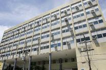
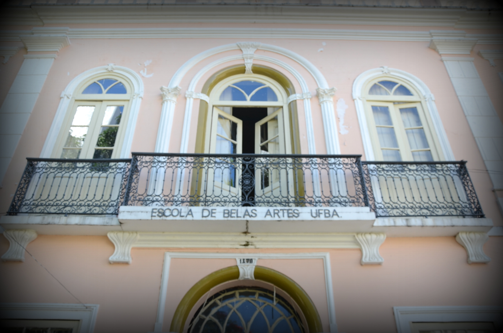
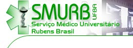

Assistência estudantil
======================

Bibliotecas
-----------

A UFBA dispõe de 22 (vinte e duas) bibliotecas que oferecem empréstimos
gratuitos de material bibliográfico aos estudantes da UFBA.

### Biblioteca Universitária Reitor Macedo Costa

-   Abriga acervo do Instituto de Letras, Faculdade de Comunicação,
    Instituto de Humanidades, Artes e Ciências, Instituto de Biologia,
    Faculdade de Farmácia, Escola de Medicina Veterinária, Escola de
    Dança, além de coleções especiais.

-   Horário de funcionamento: segunda a sexta-feira, das 7:30h às 21:00h
    e sábado e domingo das 8:00h às 16:00h.

-   Endereço: Rua Barão de Jeremoabo, s/n, Campus Universitário de
    Ondina, 40170-290 - Salvador

### Biblioteca Universitária de Exatas Omar Catunda

-   Abriga acervo acervo da área das ciências exatas -- Matemática,
    Estatística, Ciência da Computação, Física e Química - e também o
    acervo de Geociências.

-   Horário de funcionamento: segunda a sexta-feira, das 7:30h às
    21:00h.

-   Endereço: Rua Barão de Jeremoabo, s/n, 40170-290 - Salvador.

### Biblioteca Universitária de Saúde Prof. Álvaro Rubim de Pinho

-   Abriga acervo da Escola de Enfermagem, Escola de Nutrição, Faculdade
    de Medicina, Faculdade de Odontologia, Instituto de Ciências da
    Saúde, Instituto de Saúde Coletiva e do Hospital Universitário Prof.
    Edgard Santos.

-   Horário de funcionamento: segunda a sexta-feira, das 7:30h às 21:00h
    e sábado das 8:00h às 16:00h.

-   Endereço: Rua Basílio da Gama, s/n, Canela, 40110-907 - Salvador

### Biblioteca Universitária Isaías Alves

-   Abriga acervo da Faculdade de Filosofia e Ciências Humanas e do
    Instituto de Psicologia.

-   Horário de funcionamento: segunda a sexta-feira, das 8:00h às
    17:00h.

-   Endereço: Estrada de São Lázaro, n^o^ 197, Federação, 40210-630 -
    Salvador.

-   Tel.: (71) 3283-6438

-   E-mail: bsfch\@ufba.br

  

### Biblioteca Universitária Bernadeth Sinay Neves da Escola Politécnica

-   Horário de funcionamento: segunda a sexta-feira, das 8:00h às 22:00h
    e sábado, das 8:00h às 12:00h.

-   Endereço: Rua Aristides Novis, n^o^ 2, Federação, 40210-630 -
    Salvador.

-   Tel.: (71) 3283-9714/3283-9715/3283-9705

-   E-mail: bieng\@ufba.br

### Biblioteca Anísio Teixeira da Faculdade de Educação

-   Abriga acervo das áreas de Educação, Psicologia, Filosofia,
    Sociologia, Educação física, Esportes, Lazer.

-   Endereço: Av. Reitor Miguel Calmon, s/n, Campus Universitário do
    Canela, 40110-100 - Salvador.

-   Tel.: (71) 3283-7255/3283-7256

-   E-mail: biedu\@ufba.br

### Biblioteca da Escola de Administração

-   Abriga acervo da Escola de Administração.

-   Horário de funcionamento: segunda a sexta-feira, das 7:30h às
    20:30h.

-   Endereço: Av. Reitor Miguel Calmon, s/n, Campus Universitário do
    Canela, 40110-100 - Salvador.

-   Tel.: (71) 3283-7636/3283-7337

-   E-mail: dortas\@ufba.br

### Biblioteca da Escola de Música

-   Abriga um acervo composto de livros, periódicos, partituras, discos
    de vinil, CDs e alguns DVDs.

-   Horário de funcionamento: segunda a sexta-feira, das 7:00h às
    19:00h.

-   Endereço: Rua Basílio da Gama, s/n, Canela, 40160-060 - Salvador.

-   Tel.: (71) 3283-7909/3283-7910

-   E-mail: bibmus\@ufba.br

 

### Biblioteca da Faculdade de Economia

-   Abriga acervo dos cursos de Ciências Econômicas.

-   Horário de funcionamento: segunda a sexta-feira, das 7:00h às
    19:00h.

-   Endereço: Praça da Piedade, n^o^ 6, Centro, 40070-010 - Salvador.

-   Tel.: (71) 3283-7587

-   E-mail: fcebibl\@ufba.br

### Biblioteca de Arquitetura

-   Abriga acervo dos cursos de Arquitetura e Urbanismo.

-   Horário de funcionamento: segunda a sexta-feira, das 8:00h às
    22:00h.

-   Endereço: Rua Caetano Moura, n^o^ 121, Federação, 40210-350 --
    Salvador.

-   Tel.: (71) 3283-5888

-   E-mail: bibarq\@ufba.br

### Biblioteca do Centro de Estudos e Terapia do Abuso de Drogas -- CETAD

-   Abriga acervo relacionado ao uso ou abuso de substâncias
    psicoativas.

-   Horário de funcionamento: segunda a sexta-feira, das 8:00h às 12:00h
    e das 14:00h às 18:00h.

-   Endereço: Rua Pedro Lessa, n^o^ 123 Canela, 40110-050 - Salvador.

-   Tel.: (71) 3336-3322/3336-5341

-   E-mail: bibliotecacetad\@hotmail.com

  

### Biblioteca do Instituto de Ciência da Informação

-   Abriga acervo dos cursos de Ciência da Informação.

-   Horário de funcionamento: segunda a sexta-feira, das 8:00h às
    19:00h.

-   Endereço: Av. Reitor Miguel Calmon, s/n, Canela, 40110-100 -
    Salvador.

-   Tel.: (71) 3283-7757

-   E-mail: bibici\@ufba.br

### Biblioteca do Museu de Arte Sacra

-   Abriga acervo relativo a Religião, Arte, História, entre outros.

-   Horário de funcionamento: segunda a sexta-feira, das 11:30h às
    17:00h.

-   Endereço: Rua do Sodré, n^o^ 276, Dois de Julho, 40060-240 -
    Salvador.

-   Tel.: (71) 3283-5604

-   E-mail: bibmas\@ufba.br

 

### Biblioteca Nelson de Araújo da Escola de Teatro

-   Horário de funcionamento: segunda a sexta-feira, das 8:00h às
    19:00h.

-   Endereço: Rua Araújo Pinho, n^o^ 292, Canela, 40110-150 - Salvador.

-   Tel.: (71) 3283-7873

-   E-mail: bitea\@ufba.br

### Biblioteca do Centro de Estudo Afro-Oriental -- CEAO

-   Horário de funcionamento: segunda a sexta-feira, das 8:00h às
    19:00h.

-   Endereço: Praça General Inocêncio Galvão, n^o^ 42, Largo 2 de Julho,
    40060-055, Salvador.

-   Tel.: (71) 3283-5515/3283-8628/3283-8630

-   E-mail: biceao\@ufba.br

### Biblioteca Shiguemi Fujimori do Instituto de Geociências

-   Abriga acervo das áreas de Geografia, Geologia, Oceanografia e
    Geofísica.

-   Horário de funcionamento: segunda a sexta-feira, das 8:00h às
    21:00h.

-   Endereço: Instituto de Geociências, Rua Barão de Jeremoabo, s/n,
    3^o^ piso, Campus Universitário de Ondina, 40170-020 - Salvador.

-   Tel.: (71) 3283-8628/3283-8630

-   E-mail: bigeo\@ufba.br

### Biblioteca Sofia Olszewski Filha da Escola de Belas Artes

-   Horário de funcionamento: segunda a sexta-feira, das 8:00h às
    19:00h.

-   Endereço: Av. Araújo Pinho, n^o^ 212, Canela, 40110-150 - Salvador.

-   Tel.: (71) 3283-7932

-   E-mail: bibeba\@ufba.br

### Biblioteca Teixeira de Freitas da Faculdade de Direito

-   Abriga acervo que abrange todas as áreas do direito.

-   Horário de funcionamento: segunda a sexta-feira, das 8:00h às 22:00h
    e sábado das 8:00h às 13:00h.

-   Endereço: Rua da Paz, s/n, 3^o^ andar, Graça, 40150-140 - Salvador.

-   Tel.: (71) 3283-9059

-   E-mail: bidir\@ufba.br

### Biblioteca Professor Gonçalo Muniz e Memorial da Saúde Brasileira

-   Abriga extenso acervo das áreas de Medicina.

-   Horário de funcionamento: segunda a sexta-feira, das 8:00h às
    17:00h.

-   Endereço: Largo Terreiro de Jesus Antiga Faculdade de Medicina, s/n,
    Pelourinho, 40026-010 - Salvador.

-   Tel.: (71) 3283-5575

-   E-mail: bibgm\@ufba.br

### Biblioteca Prof. José Bernardo Cordeiro Filho - Faculdade de Ciências Contábeis

-   Abriga acervo dos cursos de Ciências Contábeis.

-   Horário de funcionamento: segunda a sexta-feira, das 8:00h às
    19:00h.

-   Endereço: Avenida Reitor Miguel Calmon, s/n, Vale do Canela,
    40110-903 -- Salvador.

-   Tel.: (71) 3283-8771

-   E-mail: bibcontabeis\@ufba.br

### Biblioteca do Campus Universitário Anísio Teixeira

-   Abriga acervo das áreas de atuação de cada curso do Campus.

-   Horário de funcionamento: segunda a sexta-feira, das 7:00h às
    19:00h.

-   Endereço: Rua Rio de Contas, n^o^ 58, Candeias, 45029-094 - Vitória
    da Conquista.

-   Tel.: (71) 3429-2721

-   E-mail: bcat\@ufba.br

### Consulta ao acervo, reserva e renovação

Através do sistema PERGAMUM os estudantes podem consultar o acervo
bibliográfico das bibliotecas, bem como a quantidade disponível de
exemplares. Os estudantes, por meio do número de matrícula e senha,
podem também verificar o histórico de empréstimo, a data de devolução,
fazer renovações e acompanhar as reservas.

---

Residências universitárias
==========================

Modalidade de acesso a moradia em que a UFBA, através de aparato próprio
ou sob contrato, gerencia espaços onde são assegurados, além da moradia,
áreas comuns para estudos e convivência, durante o tempo médio do curso.
As Residências Universitárias da UFBA, em Salvador/Ba, são distribuídas
em 4 complexos de moradias estrategicamente localizas próximas dos campi
da Universidade. A 1ª localizada no Corredor da Vitória, a segunda no
Largo da Vitória,a terceira na Graça e a quarta na Avenida Anita
Garibaldi.

Restaurantes universitários
===========================

O restaurante universitário da UFBA distribui refeições no período do
almoço e da janta necessitando apenas apresentar o comprovante de
matricula e pagar um valor de R\$ 2,50. Porém, as refeições são
limitadas e distribuídas por ordem de chegada. Sendo o número de fichas
em torno de 400, é preciso chegar com certa antecedência para conseguir
pegar a refeição. São oferecidas duas opções: vegetariana e tradicional.

Creche
======

### Auxílio Creche

Estudantes em vulnerabilidade socioeconômica têm o direito ao Auxílio
Creche que consiste em um auxílio para custeio de despesas com cuidado e
serviço de educação infantil na faixa etária de 4 (quatro) meses a 3
(três) anos e 11 (onze) meses de idade. Os estudantes devem estar
regulamente matriculados em curso de graduação e não podem ter vínculo
empregatício.

### Serviço Creche UFBA

A Creche UFBA é uma unidade vinculada à PROAE que atende crianças filhas
de estudantes, servidores e professores da UFBA, com idades entre 4
(quatro) meses a 3 (três) anos e 11 (onze) meses. Constitui-se de um
espaço de aprendizado que promove atividades educativas e culturais,
contribuindo para o desenvolvimento educacional e psicológico da
criança. A depender da idade\*, as crianças são divididas nos seguintes
grupos:

-   Berçário - 4 meses

-   Grupo 1 - 1 ano

-   Grupo 2 - 2 anos

-   Grupo 3 - 3 anos

\* Idade da criança até março do ano atual

A comunicação entre a Creche UFBA e os pais é feita através de reuniões
gerais, reuniões individualizadas (ou por pequenos grupos) e pela
comissão de pais.

### Horários de atendimento da Creche UFBA

Os horários da Creche UFBA obedecem ao calendário acadêmico e seu
funcionamento ocorre de segunda a sexta-feira (exceto em feriados e
pontos facultativos) e possui dois regimes:

-   integral - das 7 às 18 horas

-   parcial - das 7 às 13 horas no turno matutino ou das 13 às 18 horas
    no turno vespertino

Serviço Médico Universitário Rubens Brasil
==========================================

O SMURB -- Serviço Médico Universitário Rubens Brasil -- foi criado em
1952 para atender os estudantes carentes, mas com a entrada do Doutor
Rubens Brasil o serviço foi ampliado para os docentes, funcionários e
seus respectivos familiares. Para ter acesso a este serviço o associado
a UFBA tem de passar por uma triagem que é requisitada no momento de
ingresso na universidade.

BUZUFBA
=======
  
Os estudantes da UFBA podem contar com o serviço gratuito dos BUZUFBAS.
A frota conta com cinco BUZUFBAS, dois que foram recentemente
adicionados.

O BUZUFBA é o sistema de transporte intercampi da UFBA conquistado após
a greve de 2012. É um serviço gratuito planejado para facilitar a
locomoção dos estudantes que têm aulas nos diversos campi da UFBA em
Salvador, visando diminuir o tempo de locomoção entre um campus e outro,
além de evitar gastos com o transporte público podendo ser utilizado
pela comunidade.

As variadas rotas perpassam os distribuídos campi com horários fixos. O
serviço é bastante útil mas precisa ser melhorado em relação ao tamanho
da frota e aos horários de modo que não haja superlotação.

Bolsas e auxílios
=================

### Auxílios financeiros

Alunos em vulnerabilidade socioeconômica, regulamente matriculados em
curso de graduação da UFBA e que não possuam vínculo empregatício têm
direito a vários auxílios financeiros.

### Auxílio Moradia

Auxílio mensal destinado ao custeio de parte das despesas com moradia
até a conclusão da primeira graduação. Os estudantes também terão
garantidas duas refeições diárias no Restaurante Universitário e a opção
de complementação financeira para custear até mais duas refeições
diárias.

### Auxílio Transporte

Auxílio mensal referente ao valor de 3 (três) meias-passagens de ônibus
para seis dias semanais destinado ao custeio das despesas de
deslocamento.

### Auxílio a Pessoa com Necessidades Educativas Especiais

Auxílio mensal destinado à estudantes de graduação que apresentem
deficiência física, intelectual ou sensorial (auditiva ou visual),
transtornos globais do desenvolvimento e altas habilidades e
superdotação. Os estudantes também terão a opção de complementação
financeira para custear até duas refeições diárias.

### Serviço de Alimentação

Garantia de duas refeições diárias realizadas no Restaurante
Universitário.

Programa Permanecer
-------------------

Destinado a estudantes em vulnerabilidade socioeconômica na
universidade, visando assegurar a permanência bem-sucedida e garantindo
a terminalidade dos estudos em nível de graduação.Para participar, o
aluno deve submeter de projetos, para avaliação, em uma das áreas de
Iniciação: Extensão,Ensino, Pesquisa ou Aprendizagens Profissionais.

